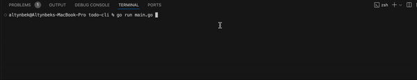

# todo-cli

Simple todo list tracker using cli

<p align="center">
    
</p>

# Features

- create
- print (list or board)
- update status (todo, in progress, done)
- delete

How to use:

```bash
go run main.go
```

Demo:


